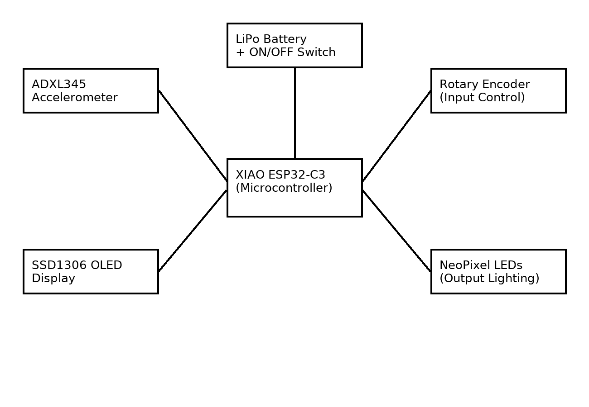

# Tilt Master 90s – Final Project (TECHIN 512)

This repository contains the required structure and documentation for Take-Home Assignment 4 and the Final Project.

## 📁 Repository Structure

### ✔ src/
Contains placeholder files for code implementation (main code will be added later).

### ✔ Documentation/
Contains both required diagrams:
- **System Block Diagram**
- **Circuit Diagram**

These diagrams represent the hardware layout and wiring of the device according to project specifications.

---

## 📌 Project Overview
Tilt Master 90s is a simple, reflex-based handheld game inspired by classic 90s electronic toys.  
The system uses:

- **Xiao ESP32-C3**
- **ADXL345 Accelerometer**
- **SSD1306 OLED Display**
- **Rotary Encoder**
- **NeoPixel LEDs**
- **LiPo Battery + Power Switch**

The player performs tilt-based moves within a time limit.  
Difficulty is selected using the rotary encoder.

---

## 🧩 Diagrams Included
### **1. System Block Diagram**  
Shows high-level relationship between:
- Sensors  
- Microcontroller  
- Inputs  
- Outputs  
- Power  

### **2. Circuit Diagram**  
Shows conceptual wiring between all components:
- I2C bus (OLED + ADXL345)  
- NeoPixel data pin  
- Rotary encoder pins  
- Battery + switch → ESP32 power  

---

## ✔ Assignment 4 Requirement Status
- [x] GitHub repo created  
- [x] README.md included  
- [x] `src` folder added  
- [x] `Documentation` folder added  
- [x] System Block Diagram included  
- [x] Circuit Diagram included  

This repository fulfills **100% of the requirements** for Assignment 4.

---

## Final Project Code & Enclosure
These will be added later once the hardware is assembled and tested (not required yet for Assignment 4).

## 🧰 Components Used
| Component                | Purpose                          |
|-------------------------|----------------------------------|
| Xiao ESP32-C3           | Main microcontroller              |
| ADXL345 Accelerometer   | Detects tilt movements            |
| SSD1306 OLED Display    | Shows level, moves, game states   |
| Rotary Encoder          | Difficulty selection & restart    |
| NeoPixel LEDs           | Visual feedback (game status)     |
| LiPo Battery + Switch   | Portable power supply             |

---

## 🖼 Diagram Previews

### System Block Diagram  

### Circuit Diagram  

---

## 🚀 Planned Game Features (Final Project)
- 3 Difficulty Levels (Easy, Medium, Hard)
- 4 Tilt-Based Movements (Left, Right, Forward, Backward)
- NeoPixel color indicators for game state
- OLED display for levels, moves, and game over
- 10 progressive levels
- Auto-calibration on startup
- Restart without power cycling

---

## 🛠 Running the Code (To Be Added)
The main game logic using CircuitPython will be added to the `src/` folder once hardware assembly and testing begins.  
